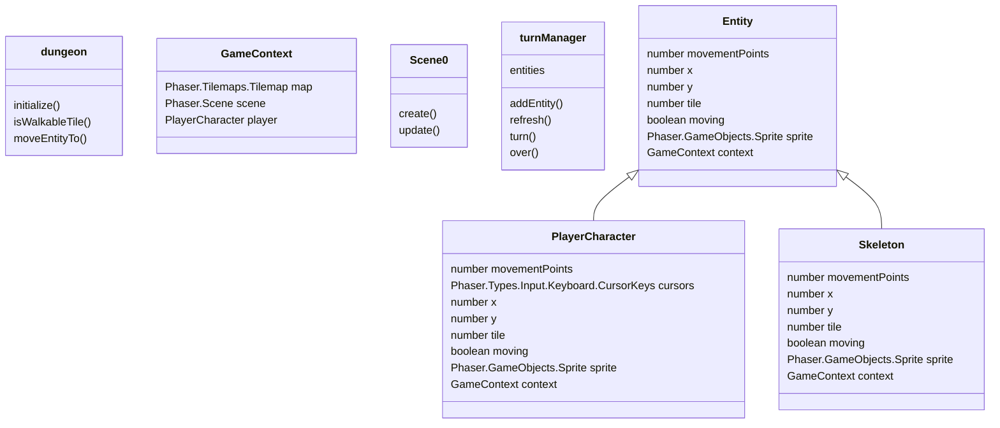

Implementation of the game from the book [Roguelike Development with JavaScript](https://link.springer.com/book/10.1007/978-1-4842-6059-3) 

Deployed [here](https://hidden-smoke-7075.fly.dev/games/rogue0/rogue0)

